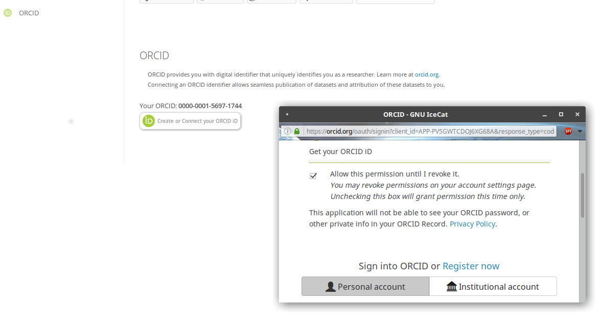

Based on user_orcid from Lars Naesbye Christensen, DeIC for ownCloud - https://github.com/deic-dk/user_orcid

# Authenticate with ORCID

This app will use the API from https://orcid.org/ to access and archive users' 
ORCID information.
 
## Dependencies 
 * nextcloud 10 (tested on nc12)

## Installation instructions
Copy the app files to the **nextcloud/apps/** directory.
In the Admin Interface, fill the data with the API credential (Client ID + Client secret) from https://orcid.org/developer-tools. The redirect URL displayed in the Admin Interface (Nextcloud) will be used to setup your API on the ORCID Interface.

## Usage

In the Personal Settings Interface, your users will identify themself using Orcid OAuth2 and grant access to the nextcloud. The OrcID (0000-00xx-xxxx-xxxx) and an access_token are saved into the database:

 - When the user clicks the 'Confirm ORCID' button, they are taken to orcid.org (in a new window) for authentication.
 - After successful login and authentication, orcid.org service sends data back to nextcloud via access token.
 - The token is used to obtain ORCID and associated name from the service.
 - The user's ORCID is then stored in the nextcloud database for access by other apps, and displayed next to the button.

## Api

Requesting ORCID from another app:

>     $orcid = \OCA\Orcid\Service\ApiService::getUserOrcid($username);
